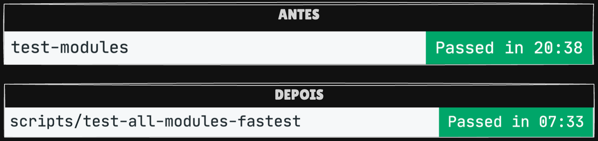

# FasTest 🚀

Uma ferramenta Dart para execução rápida e eficiente de testes unitários, especialmente otimizada para projetos Flutter.

## Antes e depois



## Características ✨

- **Saída Simplificada**: Mostra apenas nomes dos arquivos de testes com falhas
- **Suporte a Cobertura**: Geração de relatórios de cobertura de código com instalação interativa do pacote full_coverage
- **Performance**: Significativamente mais rápido que a execução padrão do Flutter test
- **Interface Amigável**: Feedback visual com cores e mensagens claras
- **Flexibilidade**: Múltiplas formas de especificar o caminho dos testes
- **Execução Paralela**: Suporte a execução paralela entre módulos com controle de concorrência
- **Suporte a Monorepo**: Execução automática em todos os pacotes de um monorepo

## Instalação 📦

```bash
dart pub global activate fastest
```

Adicione o arquivo gerado pelo otimizador ao seu `.gitignore`:
```bash
echo ".test_optimizer.dart" >> .gitignore
```

## Como Funciona 🛠

1. **Geração de Testes**: Cria um arquivo único que agrupa todos os testes e executa "flutter test" neste único arquivo
2. **Verificação de Dependências**: Verifica e oferece instalação interativa do pacote full_coverage quando necessário
3. **Execução Otimizada**: Suporte a execução concorrente para melhor performance
4. **Relatório Otimizado**: Mostra apenas os arquivos que falharam com feedback visual em cores

## Por que usar FasTest?

- **Economia de Tempo**: Reduz significativamente o tempo de execução dos testes
- **Facilidade de Uso**: Interface simples e direta
- **Manutenção**: Saída limpa e focada no caso de falhas
- **Escalabilidade**: Preparado para projetos grandes e modulares

## Uso 🔧

Execute os testes em seu projeto de três formas diferentes:

1. Na pasta atual:
```bash
fastest
```

2. Especificando a pasta como primeiro argumento:
```bash
fastest caminho/para/pasta
```

### Opções Disponíveis

```bash
# Execução com cobertura de código
# Verifica e instala interativamente o pacote full_coverage se necessário
# Use -y para instalar automaticamente
fastest --coverage

# Desabilita execução multicore
fastest --no-concurrency

# Define a quantidade de núcleos a serem utilizados
fastest caminho/para/pasta --concurrency=[4]
```

## Execução Paralela 🔄

O FasTest agora suporta execução paralela de testes entre módulos:

- Detecta automaticamente pacotes com testes no monorepo
- Executa testes em paralelo respeitando o limite de concorrência
- Controla recursos do sistema limitando execuções simultâneas
- Mantém feedback em tempo real da execução de cada módulo

## Monorepo 📦

No modo monorepo (`--package`), o FasTest:

- Busca automaticamente nas subpastas todos os pacotes que contêm testes
- Executa os testes de cada pacote em paralelo
- Respeita o limite de concorrência definido
- Fornece feedback individual por pacote
- Agrega os resultados em um único relatório

```bash
# Execução em modo monorepo (busca e executa testes em todos os pacotes)
fastest --package
```

## Documentação 📚

Para informações detalhadas sobre arquitetura, API e contribuição, consulte a documentação completa:

- **[📖 Documentação Completa](docs/README.md)** - Índice de toda a documentação
- **[🏗️ Arquitetura](docs/ARCHITECTURE.md)** - Design e estrutura do projeto
- **[📘 API Reference](docs/API.md)** - Referência completa da API
- **[🤝 Guia de Contribuição](docs/CONTRIBUTING.md)** - Como contribuir com o projeto
- **[🚀 Roadmap](docs/ROADMAP.md)** - Planejamento e features futuras
- **[💡 Melhorias Propostas](docs/IMPROVEMENTS.md)** - Propostas de melhorias

## Suporte 💬

- 🐛 **Bugs**: [Abra uma issue](https://github.com/aphenrique/fastest/issues/new?template=bug_report.md)
- 💡 **Features**: [Inicie uma discussão](https://github.com/aphenrique/fastest/discussions/new?category=ideas)
- 🤝 **Contribuições**: Veja o [Guia de Contribuição](docs/CONTRIBUTING.md)
- 📖 **Documentação**: Consulte a [documentação completa](docs/README.md)

Contribuições são bem-vindas! Faça um clone do repositório e submeta seu PR com uma boa descrição do objetivo e execução do código adicionado.

## Licença 📄

MIT License - veja o arquivo [LICENSE](LICENSE) para mais detalhes.